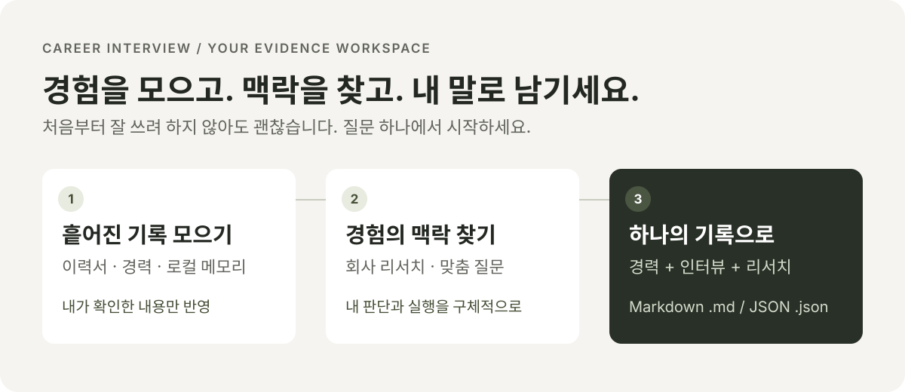

  <strong>NOSCE TE IPSUM</strong> 
  Know yourself. Tell your story.

# 커리어 인터뷰

### 기억 속 경험을, 설명할 수 있는 경력으로.

이력서와 흩어진 작업 기록에서 시작해, 지원할 회사와 직무를 살펴보고, 나에게 맞는 질문에 답하세요. **커리어 인터뷰**는 경력의 배경·판단·실행·성과를 차근차근 정리하는 macOS · Windows 데스크톱 앱입니다.

완성된 자기소개서를 대신 써주는 서비스가 아니라, 다음 지원서와 면접에 활용할 **내 경험의 근거**를 모으는 작업 공간입니다.

[**최신 버전 다운로드 →**](https://github.com/algocracy-ai/nosce-te-ipsum-releases/releases/latest) &nbsp; · &nbsp; [시작하기](#시작하기) &nbsp; · &nbsp; [연결과 데이터](#연결과-데이터) &nbsp; · &nbsp; [변경 기록](https://github.com/algocracy-ai/nosce-te-ipsum-releases/releases)

## 흩어진 기록에서, 나만의 이야기까지

| 하고 싶은 일 | 커리어 인터뷰에서 할 수 있는 일 |
| --- | --- |
| **내 경력 정리하기** | 이력서 등 자료를 첨부하거나 드래그해 가져오고, 경력·학력·프로젝트 정보를 확인하고 수정합니다. |
| **잊었던 경험 찾기** | 로컬 Codex·Claude 기록을 메모리 소스로 분석합니다. 기간과 경험의 연결을 살펴보고, 제안을 검토한 뒤 필요한 내용만 반영합니다. |
| **지원 맥락 이해하기** | 회사·직무·채용 공고와 내 경험을 연결해 리서치합니다. 지원 회사가 아직 없어도 경험 정리나 직무 중심 인터뷰를 시작할 수 있습니다. |
| **내 역할 구체화하기** | 경력별로 질문을 펼쳐 답변합니다. 맡았던 범위, 선택한 이유, 실행 과정과 결과를 기록하고 이어서 작성합니다. |
| **하나의 기록으로 남기기** | 인터뷰를 마치면 경력·학력, 전체 질문과 답변, 리서치와 출처를 하나의 `.md` 또는 `.json` 파일로 내보냅니다. |

> **AI의 제안이 곧 사실은 아닙니다.** 메모리 속 이야기가 업무였는지, 개인 프로젝트였는지 직접 확인하세요. 기억나지 않는 숫자와 성과는 꾸며내지 않고, 확인할 항목으로 남겨두면 됩니다.

## 다운로드

[최신 정식 릴리즈](https://github.com/algocracy-ai/nosce-te-ipsum-releases/releases/latest)의 **Assets**에서 내 컴퓨터에 맞는 설치 파일을 선택하세요. 파일명 앞의 버전 번호는 릴리즈마다 달라집니다.

| 컴퓨터 | 설치 파일 | 요구 사항 |
| --- | --- | --- |
| **Mac · Apple Silicon** | `career-interview_<버전>_macos-arm64.dmg` | M 시리즈 · macOS 13 이상 |
| **Mac · Intel** | `career-interview_<버전>_macos-x64.dmg` | Intel Mac · macOS 13 이상 |
| **Windows** | `career-interview_<버전>_windows-x64.exe` | x64 · Windows 10 1809 이상 · WebView2 |

**Mac:** DMG를 열고 앱을 Applications 폴더로 옮겨 실행하세요. 정식 릴리즈에는 Developer ID 코드 서명과 Apple 공증이 적용됩니다.

**Windows:** EXE 설치 프로그램을 실행하세요. **현재 Windows 게시자 서명(Authenticode)은 미적용**이므로 SmartScreen 등에서 경고가 표시될 수 있습니다. 배포 출처와 파일을 확인하고, 조직의 보안 정책을 따르세요. macOS 서명이나 업데이트용 `.sig`는 Windows 게시자 서명을 대신하지 않습니다.

설치 파일이 많이 보이나요?

- 직접 설치할 때는 위 표의 **DMG 또는 EXE 한 개**만 받으면 됩니다.
- `.app.tar.gz`, `.sig`, `latest.json`은 앱 내 업데이트에 사용하는 파일입니다.
- `SHA256SUMS.txt`는 다운로드 무결성 확인용, `build-info.json`은 빌드 정보입니다.
- GitHub의 `Source code (zip/tar.gz)`는 이 공개 안내 저장소의 압축 파일입니다. 앱 설치 파일이나 비공개 앱 소스가 아닙니다.

## 시작하기

1. **AI 연결하기**

   설정에서 GPT 또는 Claude를 연결합니다. GPT는 이 컴퓨터의 로그인된 Codex CLI를 사용할 수 있고, CLI 없이 앱에서 ChatGPT 계정으로 로그인할 수도 있습니다. Claude는 공식 Claude Code CLI 연결을 사용합니다. 분석 모델과 추론 수준은 별도로 선택합니다.

2. **내 자료 확인하기**

   새 인터뷰에서 자료를 첨부하고 내 정보를 다듬습니다. 메모리를 가져왔다면 실제 업무·사이드 프로젝트와 기간을 확인한 후 제안을 반영하세요.

3. **지원 맥락 정하기**

   회사와 직무, 공고 정보를 입력해 리서치하거나, 회사 미정 상태에서 경험·직무 중심으로 시작하세요. 공고 페이지를 읽지 못하면 내용을 직접 붙여넣을 수 있습니다.

4. **질문에 답하고 내보내기**

   경력별 질문에 답변을 남깁니다. 인터뷰 완료 후 **전체 기록 Markdown (.md)** 또는 **전체 기록 JSON (.json)** 메뉴를 선택하면 됩니다. 원본 첨부 파일과 메모리 대화 전문은 전체 기록에 포함되지 않습니다.

## 연결과 데이터

**내 컴퓨터에서 정리하고, 선택한 AI로 분석합니다.**

- 경력과 인터뷰 작업은 로컬 앱에서 관리합니다. 로컬 앱이라는 말이 AI까지 오프라인으로 실행된다는 뜻은 아닙니다.
- AI 분석을 요청하면 선택한 제공자에게 분석에 필요한 입력 자료가 전송됩니다. 인터넷 연결과 해당 계정의 모델 접근 권한이 필요합니다.
- 기존 구독의 사용 한도와 제공자 정책이 적용됩니다. 앱 연결이 무제한 이용이나 추가 비용 면제를 의미하지는 않습니다.
- GPT의 앱 내 ChatGPT 로그인은 공개 URL 읽기를 지원하지만, Codex CLI의 웹 검색과 동일한 기능은 아닙니다. 리서치 출처와 누락된 내용을 확인하세요.
- 내보낸 파일에는 이름·학력·경력 등 개인정보가 포함될 수 있습니다. 외부에 공유하기 전에 내용을 검토하세요.

## 업데이트

**설정 → 앱 업데이트**에서 최신 버전을 확인할 수 있습니다. 업데이트 가능한 버전은 앱에서도 안내하며, 다운로드와 설치·재시작은 사용자의 선택으로 진행합니다. 자동 업데이트 기능이 없는 이전 설치본은 새 설치 파일로 한 번 수동 업데이트해 주세요.

## 오류가 발생했다면

먼저 [최신 릴리즈의 변경 기록](https://github.com/algocracy-ai/nosce-te-ipsum-releases/releases/latest)과 AI 연결 상태를 확인해 주세요. 문제를 전달할 때는 **앱 버전 · 운영체제 · 연결 방식 · 오류 코드 · 재현 방법**을 함께 알려주시면 확인에 도움이 됩니다. 공개된 공간에는 원본 이력서, 대화 기록, 토큰, 인증 코드나 개인 키를 올리지 마세요.

---

Algocracy의 커리어 인터뷰 공식 배포 저장소입니다. 제품 안내·소개 이미지와 설치/업데이트 파일만 공개하며, 앱 소스와 개발 이력은 별도 비공개 저장소에서 관리합니다. 앱에 포함된 오픈소스 라이선스와 런타임 재빌드 안내는 설치 패키지에서 확인할 수 있습니다. OpenAI·Anthropic의 공식 제품은 아닙니다.
